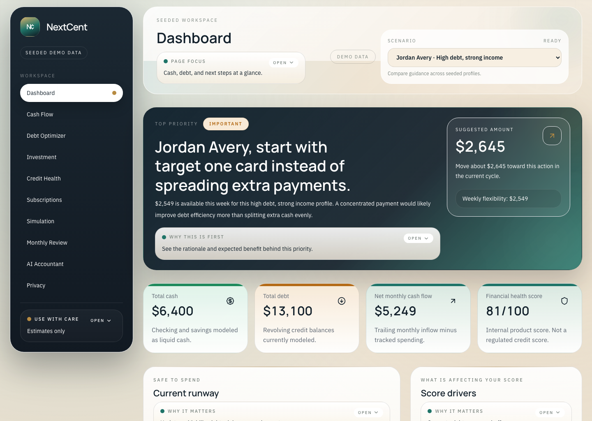
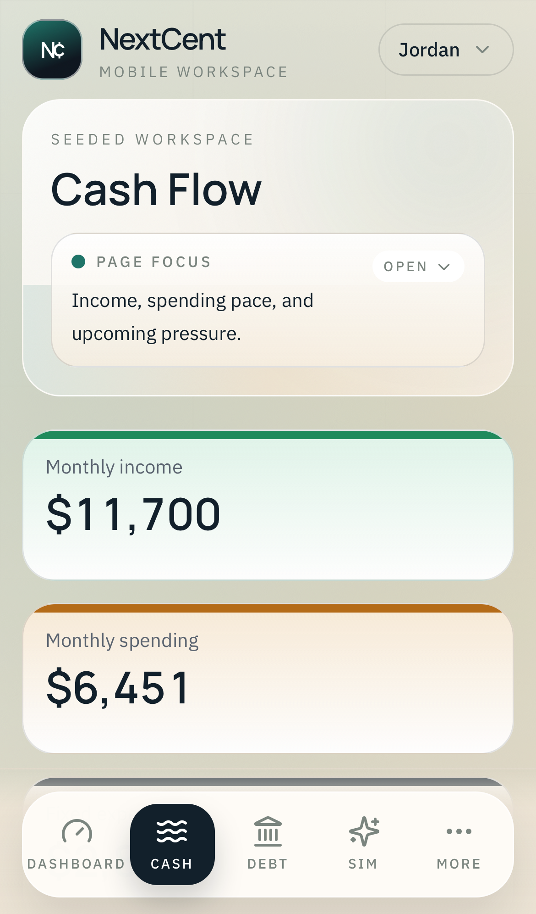
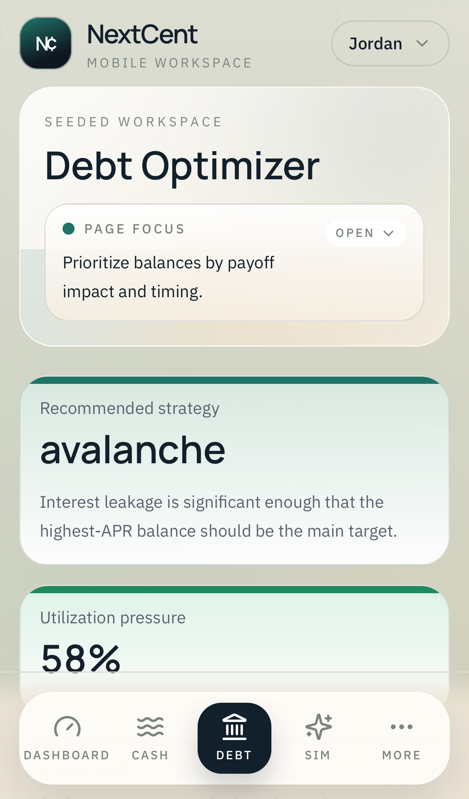

# NextCent

[](https://github.com/ennis-kurt/NextCent/actions/workflows/ci.yml)

NextCent is a seeded personal finance decision-support app built to make cash flow, debt pressure, subscriptions, score drivers, and next actions easier to interpret. It combines deterministic financial modeling with a grounded AI explanation layer, then packages that into a premium web workspace that runs well on desktop and mobile.

- Live app: [web-wheat-psi-95.vercel.app](https://web-wheat-psi-95.vercel.app)
- Stack: Next.js 15, React 19, FastAPI, SQLAlchemy, shared TypeScript contracts, Vercel deployments

## Screenshots

### Desktop dashboard



### Mobile experience

| Cash Flow | Debt Optimizer |
| --- | --- |
|  |  |

## What the app does

NextCent is structured around seeded financial personas rather than live bank connections. Each persona represents a realistic money situation so the product can demonstrate:

- a daily decision dashboard with Safe to Spend, score drivers, leakage, and top-priority actions
- cash-flow analysis with runway, pace, and category breakdowns
- debt strategy comparison with per-card actionable payment plans
- investment guidance that can recommend investing, buffering cash, or paying debt first
- credit-health context including utilization, minimum payments, due dates, and recent interest drag
- subscription cleanup and waste-risk surfacing
- scenario simulation with saved runs and delta summaries
- monthly review, privacy notes, and a grounded AI accountant surface

The current product is intentionally read-only and demo-driven. It is built to show how a privacy-conscious financial workspace can feel useful before introducing real account connectivity.

## Monorepo layout

```text
apps/
  api/   FastAPI service, finance engines, seed data, persistence, tests
  web/   Next.js App Router app, responsive UI, charts, interaction layer
packages/
  api-contracts/   Shared TypeScript response and request contracts
  design-tokens/   Design-token source files
  mock-scenarios/  Persona and merchant metadata
docs/
  architecture/    System, schema, and runtime documentation
  branding/        Brand system and UX-writing guidance
scripts/
  bootstrap_api.sh
  run_api.sh
  run_web.sh
```

## Product surfaces

### Web app

- Landing and onboarding
- Dashboard
- Cash Flow
- Debt Optimizer
- Investment
- Credit Health
- Subscriptions
- Simulation
- Monthly Review
- AI Accountant
- Privacy

### API

- Seeded persona listing and selection
- Dashboard summary and recommendation pipeline
- Cash flow, safe-to-spend, debt, credit, subscription, and investment endpoints
- Simulation persistence and history
- Chat session persistence and grounded answer payloads
- Sanitization policy and privacy endpoints

## Local development

### Prerequisites

- Node.js with `pnpm@10`
- Python `>=3.10`

### Install workspace dependencies

```bash
pnpm install
```

### Run the API

```bash
cd apps/api
python3 -m venv .venv
source .venv/bin/activate
python -m pip install --upgrade pip
python -m pip install -e ".[dev]"
python -m uvicorn app.main:app --reload
```

### Run the web app

```bash
NEXT_PUBLIC_API_BASE_URL=http://127.0.0.1:8000/api/v1 pnpm --dir apps/web dev
```

### Useful commands

```bash
pnpm dev:web
pnpm build:web
pnpm test:api
pnpm --dir apps/web exec tsc --noEmit
```

## Verification

Run the same core checks used during development:

```bash
cd apps/api
source .venv/bin/activate
python -m pytest

cd /Users/cihatkurt/Documents/personal_accountant
pnpm --dir apps/web exec tsc --noEmit
pnpm --dir apps/web build
```

## Deployment notes

- The web app and API are deployed separately on Vercel.
- GitHub Actions verifies the web build/typecheck and API tests.
- Local development defaults to SQLite.
- The deployed API is configured for a managed Postgres database.

## Trust, scope, and limits

- This product provides guidance and prioritization, not tax, legal, or regulated investment advice.
- Recommendations are estimates based on the currently modeled persona data and explicit assumptions.
- The app is demo-seeded today; outputs are only as good as the modeled inputs.
- Major financial decisions should always be verified independently.

## Additional docs

- [System architecture](docs/architecture/system-architecture.md)
- [API and schema notes](docs/architecture/api-and-schema.md)
- [Brand system](docs/branding/brand-system.md)
- [Microcopy patterns](docs/branding/microcopy-patterns.md)
